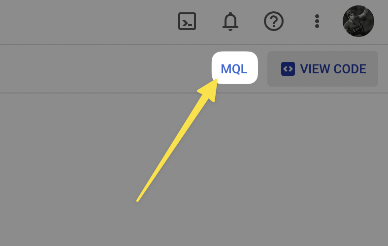

# Firestore Billing Kill Switch


This article gives you the tools to implement a billing kill switch for your Firestore database, based on number of operations.


With GCP Cloud Monitoring metrics on Firestore requests, estimate your bill and stop billing with a GCP Cloud Functions within minutes (not hours) if budget is exceeded.

## Context

### Google stopped supporting billing limits

Firebase no longer supports billing limits. This is a problem for hobbyists, or anyone developing an application who wants to make sure they won't wake up one day with a multi-thousand dollar bill.

### Firestore operations can quickly become expensive


At TimeTriggers.io, we use Firestore to store the data related to HTTP calls. If, for some reason, the application loops and edits a lot of times the same document. Or if there is a glitch in our client code that makes 100 times more operations than it should. This can quickly add up to a lot of money. And we want to know it as soon as possible.

### Existing solutions

Google Cloud Monitoring exposes metrics that translate your Firestore operations into a cost estimate. However, these metrics are not available in real time, and it can take hours for these to update.

This means your kill switch will potentially take hours to react. We are detailing here a solution that allows a quicker response, within minutes.

## Solution


This solution only counts Firestore document operations (CREATE, UPDATE, DELETE). It does not count storage nor bandwidth costs.


With metrics `firestore.googleapis.com/document/(read|write|delete)_count` being updated in almost real time (a matter of minutes), we can estimate the cost of our Firestore operations and stop billing if the cost is above a certain threshold.

### Create an alert in Google Cloud Monitoring on Firestore operations metrics

Go to Cloud Monitoring > Alerting Policies and [create a new alert](https://console.cloud.google.com/monitoring/alerting/policies/create)

Click on MQL at the top right 

Paste the following code 

```text
{ fetch firestore_instance
  | { metric 'firestore.googleapis.com/document/read_count'
      | group_by 1h, sum(val())
      | group_by [], sum(val())
      | mul 0.00000039
    ; metric 'firestore.googleapis.com/document/write_count'
      | group_by 1h, sum(val())
      | group_by [], sum(val())
      | mul 0.00000117 }
  | outer_join 0, 0
  | add
; fetch firestore_instance
  | metric 'firestore.googleapis.com/document/delete_count'
  | group_by 1h, sum(val())
  | group_by [], sum(val())
  | mul 0.00000013 }
| outer_join 0, 0
| add
| every 1m
| condition val() > 10
```



- Adapt the code to match your requirements.
  - `condition val() > 10` means that the alert will trigger if the cost is above 10$.
  - `group_by 1h` means that we're looking at the cumulated cost over a sliding window of 1h. You can increase this number up to 24h. (Not more, unfortunately.)
  - `mul 0.00000039` means that we're multiplying the number of `READ` operations by the cost per `READ` operation. You can find the cost per operation in the [Cloud Firestore pricing page](https://cloud.google.com/firestore/pricing#pricing_by_location).



Setup the alerting you want

(Optional) From there, you can setup a Pub/Sub topic that triggers a cloud function in order to disable biling. Please refer to other tutorials in order to do this.

### Create a dashboard to monitor these alerts


